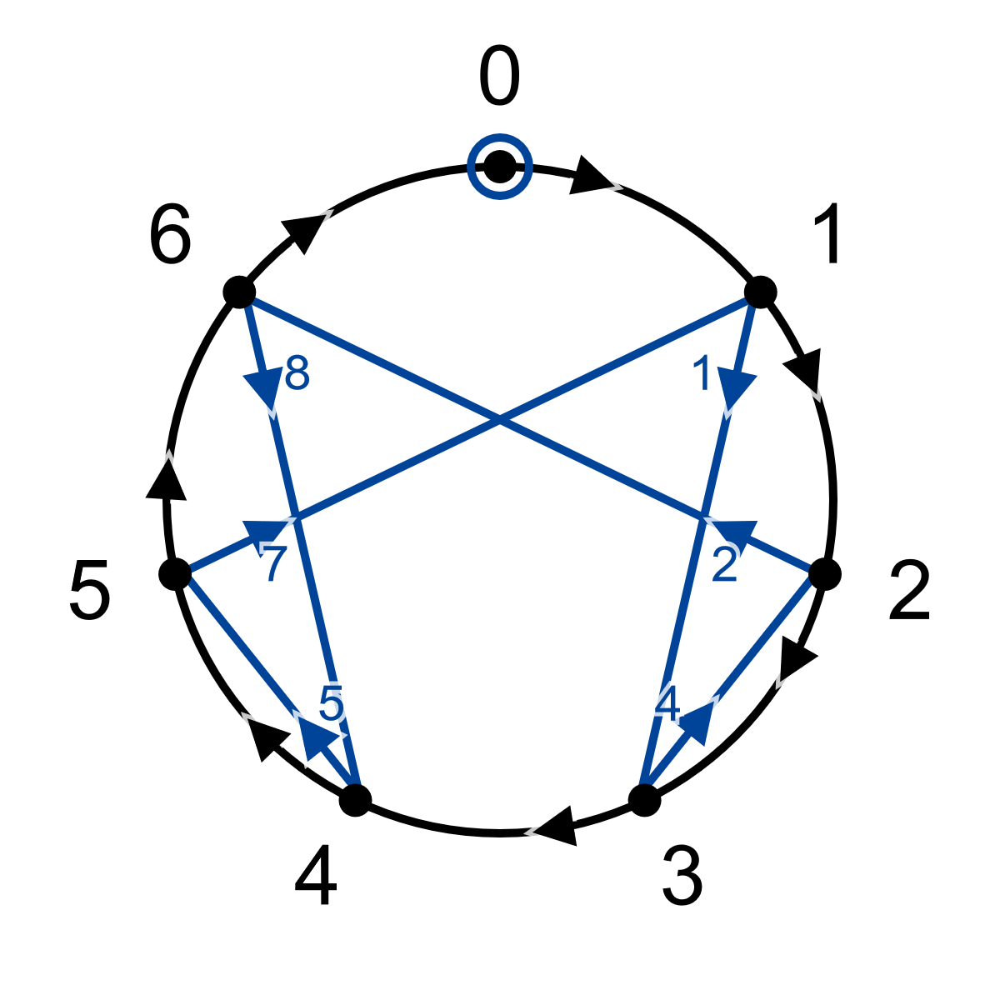
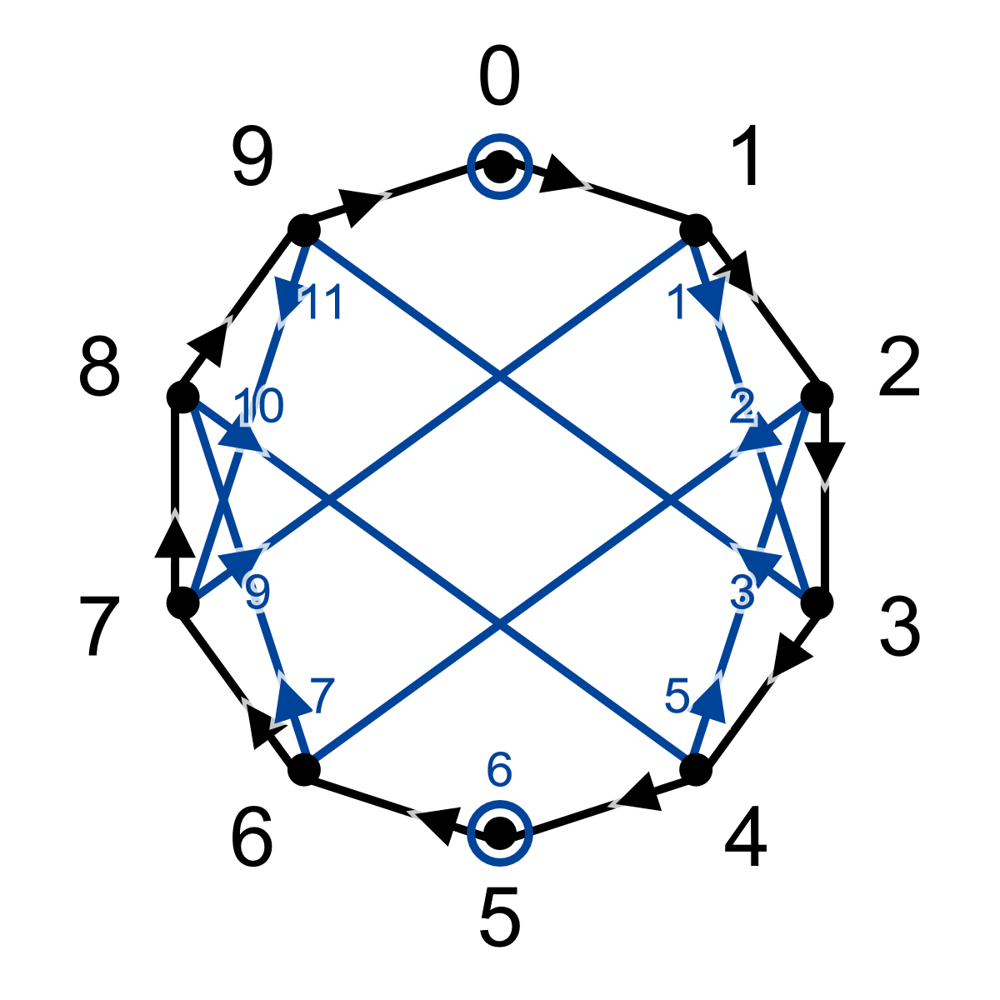
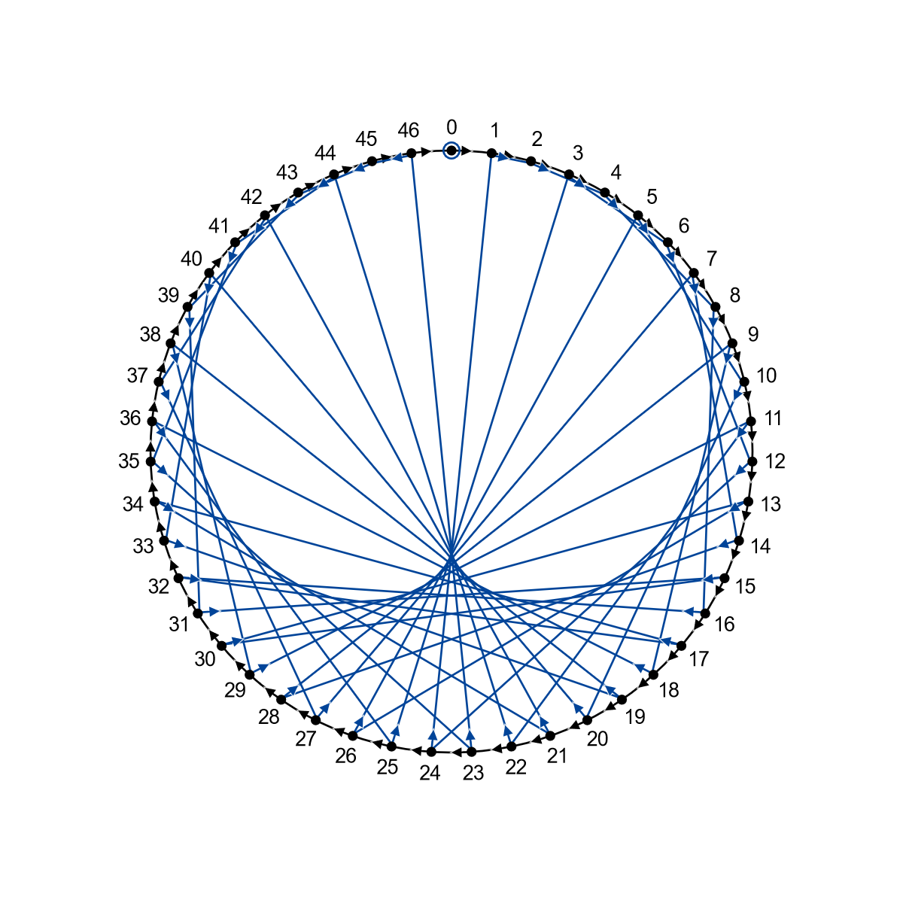
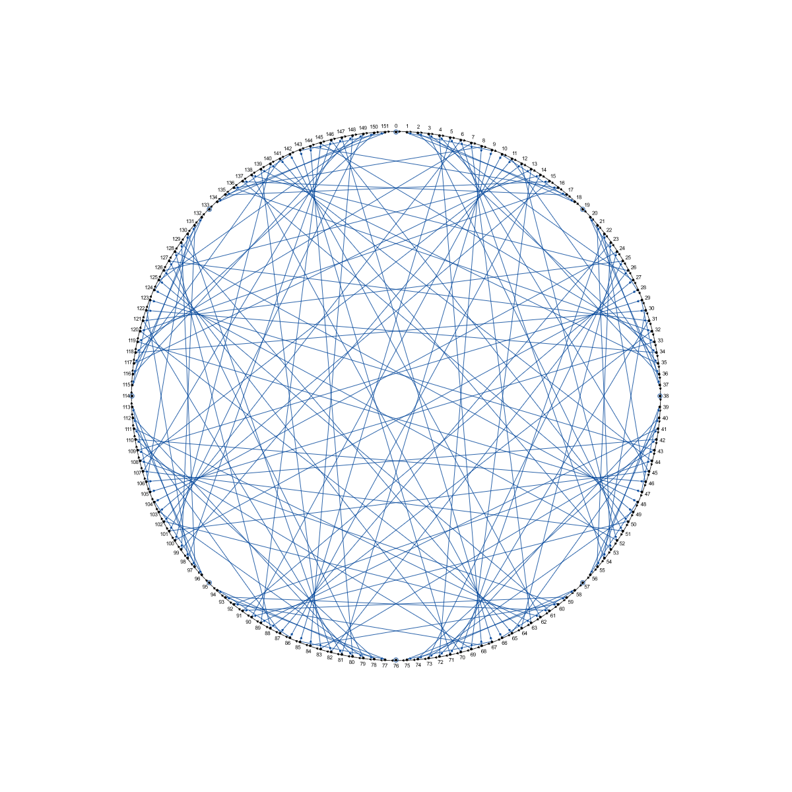
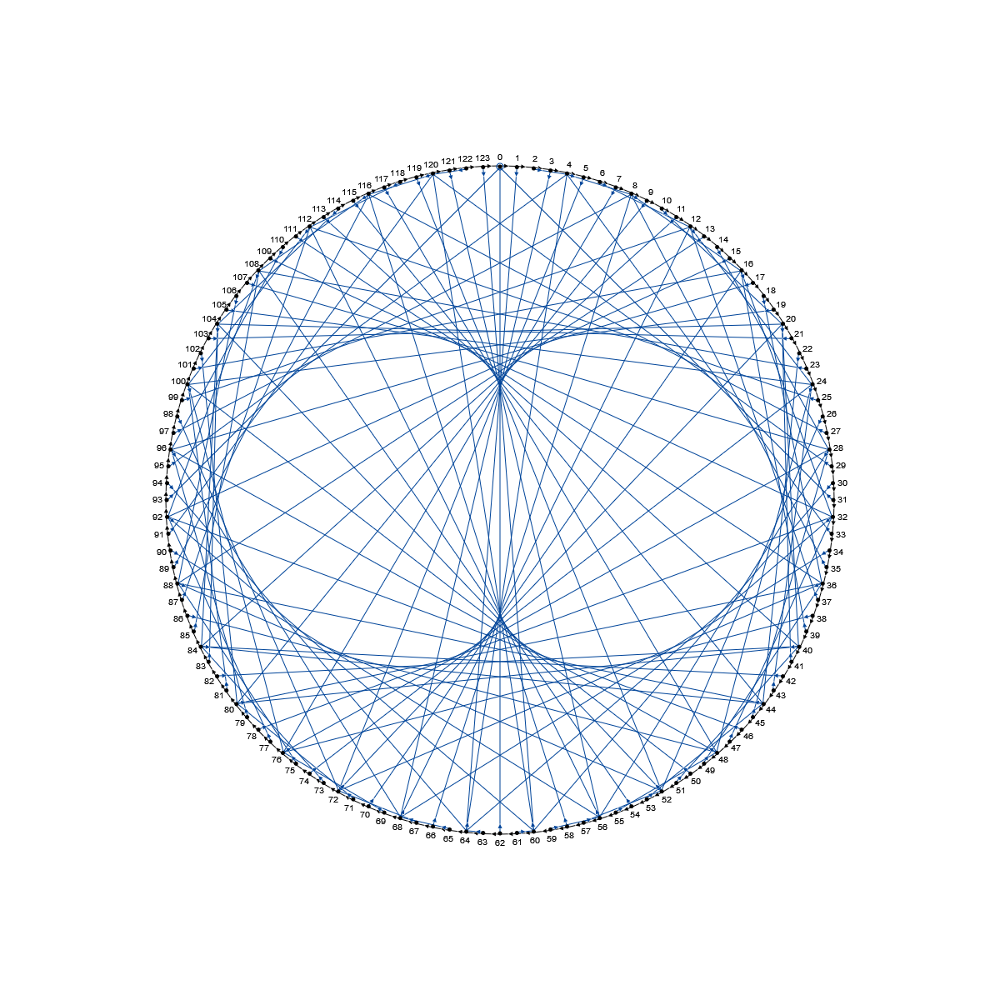
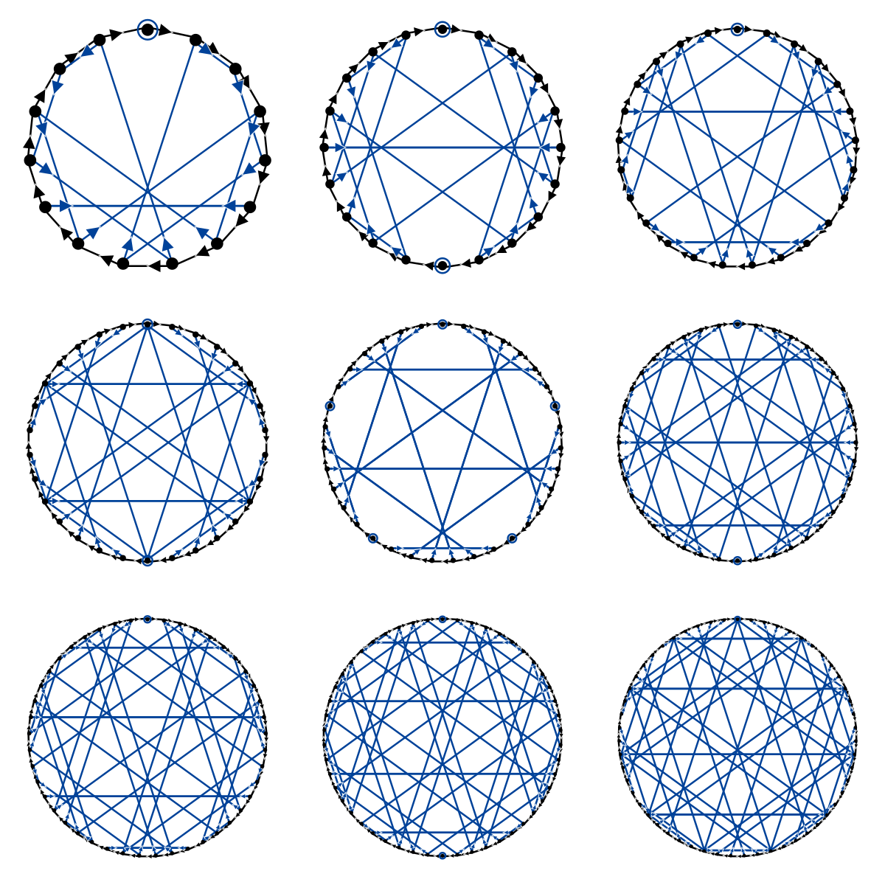
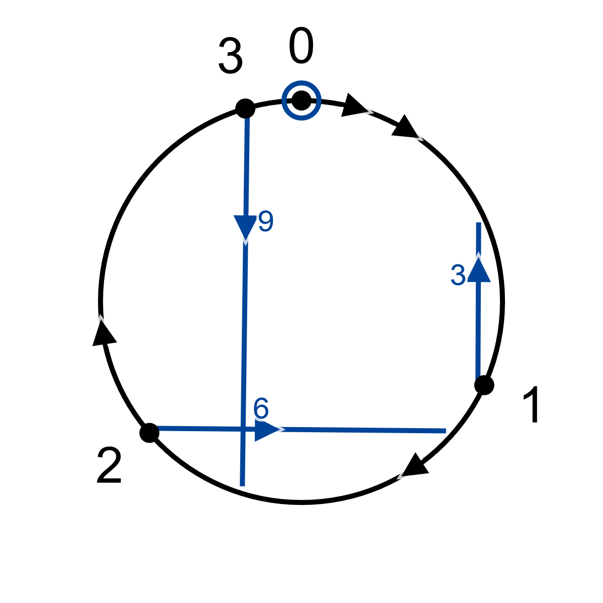

# Divisibility & division diagrams
Divisibility diagrams provide a visual way to check if a number is divisible by another, or more generally to determine its remainder on division. A diagram exists for each divisor, and can be used on an input number of any length (the dividend) by following a virtual point as it moves through coloured arrows.

By adding some digits on the inside of the diagrams, the algorithm can be extended to return quotients as well, allowing it to be used for general division (both [Euclidean](https://en.wikipedia.org/wiki/Euclidean_division) and fractional). It's probably not a particularly practical or efficient method for manual arithmetic, but I think it's an interesting one nonetheless.

<figure>

<figcaption>Diagram for division by seven.</figcaption>
</figure>

## Background
I first came across divisibility diagrams in [this 2018 blog article by Mark Dominus](https://blog.plover.com/math/divisibility-by-7.html), which prompted me to write a script to generate them for any divisor and base, and to try to come up with a way to generalise them into division diagrams.

Through further searching, I have since found versions of the specific diagram for divisibility by seven in a few other places, including one on the [French Wikipedia](https://fr.wikipedia.org/wiki/Liste_de_crit%C3%A8res_de_divisibilit%C3%A9#Utilisation_d'un_diagramme) and a planar version (without arrow intersections) in [a 2009 blog post by Tanya Khovanova and David Wilson](http://blog.tanyakhovanova.com/2009/08/divisibility-by-7-is-a-walk-on-a-graph-by-david-wilson/). The diagrams are also closely related and visually identical to the modular times tables popularised by [Mathologer](https://www.youtube.com/watch?v=qhbuKbxJsk8), as described [below](#multiplication). In the context of divisibility, however, they otherwise appear to be quite obscure, and I haven't found my idea of generalised division diagrams anywhere else (although I'm sure they must have been devised before). [Let me know](https://github.com/SilverCardioid/apps/discussions) if you know of any other interesting resources or appearances.

## Basic construction
A diagram is determined by two numbers: the divisor or modulus $n$, which is equal to the number of points around the edge, and the base $b$ to work in, which affects the blue inner connections.

The black arrows around the circumference, which I refer to as "steps", obviously link each number $i$ to its successor $i+1$ (and $n-1$ back to 0). The blue inner arrows, or "jumps", correspond to multiplication by the base [modulo](https://en.wikipedia.org/wiki/Modulo_operation) $n$, so $i$ points to $(b \cdot i) \% n$. The blue numbers next to them are the quotients (integer parts) of division of this product by $n$, i.e. $\left\lfloor \frac{b i}{n} \right\rfloor$.

For example, the diagram for division by seven above has $b=10$ (decimal) and $n=7$. Each blue arrow thus links a number to ten times its value, modulo 7. Because [$10 \equiv 3 \pmod 7$](https://en.wikipedia.org/wiki/Modular_arithmetic), the arrows are the same as if each number was tripled: 1 goes to 3, 2 to 6, and 3 to $9 \% 7 = 2$. The blue numbers are the multiples of 10 divided by 7, rounded down: $\frac{10}{7} = 1.428 \approx 1$, $\frac{20}{7} = 2.857 \approx 2$, etc. Together, they give the quotient and remainder of these fractions: $\frac{20}{7}$ is 2 with remainder 6.

A blue ring around a point serves as a stylised representation of an arrow from that point to itself. Since 0 mod anything is 0, it always has such a ring; [specific relations](#classic-rules) between the base and divisor can result in other numbers having one as well. 0 is also implied to have zero as its blue quotient number.

## App options
Besides the base and divisor, the app has a number of visual options. The dropdown menus set the base to display the blue (inner) and black (outer) numbers in; "Quotients" toggles the display of the blue quotient digits; and "Round" switches between a polygonal and circular style.

There is no theoretical limit on the values of $n$ and $b$, although the number display only works for integer bases between 1 and 36.

### Interaction
The app has an interactive mode to demonstrate the divisibility and division algorithms (the "Quotients" option toggles between the two). Clicking the "step" and "jump" buttons moves the red dot indicating the current remainder, and shows the digits of the corresponding input and output numbers. Its options are:
* Step: follow a black arrow (and increment the last digit).
* Jump: follow a blue arrow (and append a new digit).
* Dot: add a decimal point to the input and quotient lines.
* Step size: number of steps the "step" button takes, corresponding to the input digit.
* Animations: toggle smooth movement of the red dot and the digits.
* Keyboard: enable keyboard shortcuts and digit input outside the "step size" field (hover on each button to see the corresponding keys).
    * Auto-step: automatically jump and step when a digit is typed, so that division is performed by simply typing the input number.
* Reset: empty the input and quotient, and move the current point back to 0.

## Functions and algorithms

### Divisibility
The basic procedure for using the diagram is as follows:
* Start at the topmost dot (0).
* For each digit of the input number (from left to right):
    * Move along a single blue arrow ("jump").
    * Move clockwise around the diagram along the number of black arrows corresponding to the current digit ("step").
* The final position is the remainder.

This basically "builds up" the input number by iteratively multiplying by the base to shift the existing digits over, and then adding a number equal to the next digit. At each step, the dot position is updated acordingly, showing the remainder (mod $n$) of the number formed by the digits up until that point.

<figure>
<video src="demo_divisibility.mp4" controls="controls"></video>
<figcaption>A video demonstrating the use of the algorithm to find the remainder of 1729 upon division by seven. The final position is zero, so 1729 is a multiple of 7.</figcaption>
</figure>

(Since a blue ring represents a link from a dot to itself, "jumping" from such a point doesn't change the position. Because 0 always has a ring, the very first jump can be omitted, and jumps can be seen as moving from a digit to the next, as depicted in the video. Including it at the start of the loop makes the algorithm simpler, though, and the division version below makes more sense with the resulting leading 0.)

### Euclidean division
The version for division is naturally a bit more complex, as it requires keeping track of the digits of the quotient (result of division) as well as those of the input and the position of the point. An easy way to do so is to write down the input number, so that the quotient can be written below it with the digits lining up. This way, the quotient digits double as a mark that the corresponding input digits have already been used.
* Start at the topmost dot (0).
* For each digit of the input number (from left to right):
    * Move along a single blue arrow ("jump"); take the blue number next to the arrow and write it down as the next digit of the quotient.
    * Move clockwise around the diagram along the number of black arrows corresponding to the current digit ("step"); increment the last digit of the quotient whenever you reach or cross zero.
* The written-down number is the quotient; the final position is the remainder.

<figure>
<video src="demo_division.mp4" controls="controls"></video>
<figcaption>A video showing division of 3551 by thirteen. The final quotient and position show that $\frac{3551}{13}$ is 273 with remainder 2.</figcaption>
</figure>

Appending a digit for every jump works because multiplying by the base $b$ also increases the quotient and remainder by a factor $b$ (i.e., adds a 0 at the end). This new remainder $b i$ may be larger than the divisor $n$, though, so any multiples of $n$ need to be taken out of the remainder, and added to the quotient. This added amount, the integer part of $\frac{b i}{n}$, is given by the blue digit.

Steps may also impact the quotient. Note how the third jump in the video initially adds a 6 to the quotient, but the digit changes to a 7 after the following set of five steps crosses 0 in the diagram. The remainder crossing zero means that the input has passed a multiple of the divisor, which adds 1 to the quotient. One could remember this rule by thinking of it as analogous to receiving money when passing the starting square in [*Monopoly*](https://en.wikipedia.org/wiki/Monopoly_(game)).

### Fractional division
The above algorithm gives us the Euclidean quotient and remainder, but there's no need to stop there. Although the diagram itself has no concept of a decimal or radix point, shifting it (i.e., multiplying or dividing by the base) affects the dividend and quotient proportionally: if $\frac{1729}{7} = 247$, then $\frac{172.9}{7} = 24.7$ and $\frac{1.729}{7} = 0.247$. Therefore, in terms of the digits, the computation doesn't change if a fractional number is inputted, as long as a radix point is inserted in a matching place in the output.

This also means that doing normal non-Euclidean division is as easy as adding an indefinite number of zeroes after the radix point in the input, which corresponds to following just the blue arrows without any "steps" in between. The accompanying blue numbers will spell out the fractional part of the quotient. In the mod-13 diagram from the video, continuing in this way from the original remainder 2 moves us through a six-arrow cycle that results in the expanded answer $\frac{3551}{13} = 273.153846153...$

### Base conversion
The [classic algorithm](https://en.wikipedia.org/wiki/Positional_notation#Base_conversion) for converting numbers from one base to another involves repeated division. After setting the base of the diagram to the old base and the divisor to the new base, a number can be converted by iteratively applying the division algorithm on the previous quotient, and concatenating the remainders in reverse order. Setting the base of the outer numbers to the divisor may be helpful.
* Divide the input number by the new base as [above](#Division). Write the remainder down in the new base as the last (ones) digit of the output number.
* Take the quotient, and divide it by the new base. Write the remainder down as the next digit on the left.
* Repeat until the quotient is zero.

<figure>
<video src="demo_base_convert.mp4" controls="controls"></video>
<figcaption>A video showing how to use the mod-16 diagram to convert 418 from decimal to hexadecimal. The remainders after each step spell out the answer 1A2.</figcaption>
</figure>

### Multiplication
As mentioned above, the blue numbers and blue arrows of any diagram respectively correspond to the quotient and remainder of division of $b i$ by $n$. Abbreviating this quotient as $q$ and the remainder as $r$, this division can be notated by the equality

$ \frac{b i}{n} = q + \frac{r}{n} $

or, multiplying both sides by $n$,

$ b i = q n + r $

This reveals an alternative interpretation of division diagrams, namely as a visual encoding for multiplication of each number $i$ by the base $b$. Modulo-$n$ times tables, which disregard the quotients $q$ and are thus constructionally equivalent to divisibility diagrams, seem to be relatively well-known, particularly for their geometric properties. See, for instance, [this Mathologer video](https://www.youtube.com/watch?v=qhbuKbxJsk8), which covers some of the same visual patterns described in the [section below](#visual-patterns).

Including the quotients, though, the right-hand side ($q n + r$) can be read as a two-digit number in base $n$ (note that, by definition of Euclidean division, $r < n$). This essentially turns the original meaning of the diagram on its head: in addition to division by $n$ in base $b$, it encodes multiplication by $b$ in base $n$!

For example, the mod-10, base-13 diagram contains the multiples of 13 (in decimal), which can be read off by concatenating the quotient number next to any blue arrow (which is $q$) with the destination of that arrow ($r$):

<figure>

<figcaption>Divisor 10, base 13 (or in this case, base 10, multiplicand 13)</figcaption>
</figure>

The arrow that starts at the seventh dot has a 9 next to it and points to 1, so $7 \cdot 13 = 91$. Five has a 6 and links to itself, so $5 \cdot 13 = 65$.

This interpretation of the concatenated $qr$ as a base-$n$ number is somewhat complicated by the fact that $q$ might equal or exceed $n$ for higher multiples if $b > n$, and thus cannot exist as a base-$n$ digit in that case. By setting the inner base to "divisor", these values for $q$ will be converted to multi-digit numbers in base $n$, and will work as expected when concatenated. The last two multiples $8 \cdot 13 = 104$ and $9 \cdot 13 = 117$ therefore show up correctly in the diagram above. I have not found a way to adapt the division algorithm to multiply larger numbers iteratively yet.

## Visual patterns

### Epicycloids
When you set the base to 2 and crank up the divisor, you'll see [a shape](https://en.wikipedia.org/wiki/Cardioid) emerge that you might notice I have some fondness for:

<figure>

<figcaption>Bonus points if you can guess the significance of the divisor.</figcaption>
</figure>

In base 2, the blue arrows lead from each number to their double: 1 goes to 2, 2 to 4, etc. This is equivalent to [Luigi Cremona's method](https://en.wikipedia.org/wiki/Cardioid#Cardioid_as_envelope_of_a_pencil_of_lines) for drawing the cardioid: mark $n$ equally spaced numbered points on a circle, and draw lines from each point $i$ to $2i$ (modulo $n$). A higher number of points leads to a closer approximation of the shape; in the limit, as the number of points goes to infinity, the visible shape (more formally, the [envelope](https://en.wikipedia.org/wiki/Envelope_(mathematics)) of the family of lines) exactly coincides with a cardioid.

Similar shapes can be seen for other bases as well. In base 3, increasing the divisor reveals a two-bulbed, two-cusped shape called a [nephroid](https://en.wikipedia.org/wiki/Nephroid). In general, each base $b$ corresponds to a member of the [epicycloid](https://en.wikipedia.org/wiki/Epicycloid) family with $b-1$ bulbs and cusps, whose Cremona construction $b i$ matches the blue arrows of a diagram in that base.

The epicycloids also pop up whenever the divisor is one less than a multiple $k b$ of the base, with the number of bulbs being $k-1$. For example, the mod-19 diagram in decimal ($n = 2 \cdot 10 - 1$) displays another cardioid, as does the mod-31 diagram in hexadecimal. The arrows go the other way, though, as even numbers point to half of themselves. If the divisor is sufficiently high, two epicycloids will even be visible. This diagram has base 9 and modulus 152, and merges an 8-bulb (the "limit shape" for base 9) with a 16-bulb (since the divisor is $17 \cdot 9 - 1$):

<figure>

<figcaption>There need to be names for the epicycloids beyond the nephroid. An octoid and a hexadecoid, maybe?</figcaption>
</figure>

Yet another family of diagrams showcasing these shapes (at least for high enough bases) consists of the divisors leading up to the base, i.e. $n = b-k$ for $k \geq 2$. The link can be seen algebraically by substituting this value into the blue arrow formula $b i$, leading to the [congruence](https://en.wikipedia.org/wiki/Modular_arithmetic#Congruence) $(n + k) i \equiv k i \pmod n$. This latter form is equivalent to the general formula for base $k$, and hence to the $k-1$-bulb epicycloid.

Runs of divisors leading up to multiples of $b-1$ give similar but different series of shapes, sequentially containing versions of the epicycloids that are smaller and pointier. The general formula for these is $n = x (b-1) - k + 1$. In base 30, setting $k = 2$ and varying $x$ gives the divisor sequence $[28, 57, 86, 115, 144, ...]$, which produces heart-like shapes of decreasing size. Some similar modular algebra shows that these are still epicycloids, but they're fractional ones, with a "base" of $\frac{k-1}{x} + 1$ (that's $\left[2, \frac{3}{2}, \frac{4}{3}, \frac{5}{4}, ... \frac\right]$ for the heart sequence) and a "number of bulbs" of $\frac{k-1}{x}$. Reducible fractions correspond to compounds of epicycloids, so the "mini-nephroid" $\frac{4}{2}$ (e.g. $n=56$ in base 30, or $n=124$ in base 64 depicted below) is in fact two interlaced cardioids!

<figure>

<figcaption>V2hhdCBhbiBlcGljIGN5Y2xvaWQu</figcaption>
</figure>

### Classic rules
These are some easily seen patterns that are analogous to conventional [divisibility rules](https://en.wikipedia.org/wiki/Divisibility_rule). I've labelled them by the relevant divisor factors in decimal, although the patterns apply in any base.
* **3 and 9**: self-links (blue rings) on digits other than zero occur whenever $n$ is a multiple of $b-1$, or of a factor of $b-1$. The contribution of those digits to the remainder is independent of their position in a number. These factors additionally give the diagram a rotational symmetry corresponding to the number of rings. If $n$ equals $b-1$ or a factor of it, all numbers have rings. In this case, since no jumps can occur, the algorithm for the remainder comes down to summing the digits of the input number, modulo $n$. This is similar to how divisibility of a number by 3 or 9 is determined by repeatedly summing its digits.
* **2, 5, 10**: if $n$ shares a factor with $b$, some digits point to 0, corresponding to multiples of the base that are divisible by $n$. If $n$ has no other prime factors than those of $b$, it is a divisor of some power $b^k$ of it, meaning any input number can be truncated to the last $k$ digits without affecting the remainder. Compare the normal rules for divisibility by 4, 8, or other powers of 2 or 5.
* **11**: if $n = b+1$, the base multiples $i b$ are congruent to $i (n-1) \equiv i n - i \equiv -i \pmod n$. This means each point $i$ is linked by a blue arrow to its additive inverse, the point $n-i$ that is the same distance from 0, but on the other side of it. Following the divisibility algorithm thus corresponds to taking an alternating sum of the digits (mod $n$), matching the divisibility rule for 11. The visual result, given the equal spacing of the points around a circle with 0 at the top, is that all blue arrows are horizontal. More interesting patterns arise for this value's multiples ($n = k (b+1)$): the orientations of the blue arrows go through $\frac{180}{k}$-degree rotations from the horizontal in order. For $k = 2$ (e.g., $n = 22$ in decimal), they alternate between horizontal and vertical; for $k = 3$ (33), they go along multiples of 60&deg;, and so on. Despite the highly regular angles, the positions of the endpoints along a circle provide some unevenness to the resulting pattern, preventing it from being a regular grid and differentiating it from the analogous diagrams in different bases:

<figure>

<figcaption>$n = 5(b+1)$ for bases 2 through 10. Note the varying degrees of symmetry due to shared factors of $n$ with $b-1$.</figcaption>
</figure>

## Non-natural values
As hinted at above, the app doesn't break for negative or fractional values of $n$ and $b$ (or of the input number). The diagram and algorithms still work fine, despite being slightly harder to wrap your head around. For fun, I tried setting the divisor to $\pi$, and to my surprise found some more seemingly straight angles:

<figure>

<figcaption>Only in decimal, though.</figcaption>
</figure>

Since I found it rather satisfying to find out why this happens, I'll leave that as an exercise to the reader. As a hint, the arrows aren't exactly horizontal and vertical, but are for a nearby divisor.
