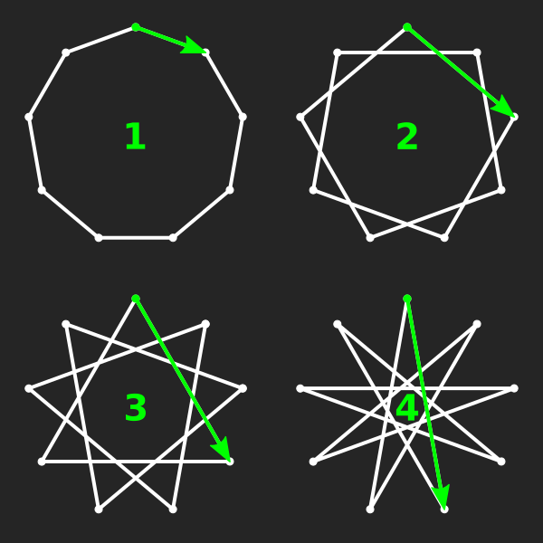
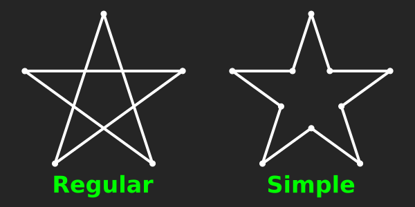

# [Star](../)

A tool for getting the SVG coordinates of arbitrary isotoxal [star polygons](https://en.wikipedia.org/wiki/Star_polygon). It may be useful if you (like me) like to edit or newly hand-code SVGs outside of a graphical interface like Inkscape or Illustrator. The output string can be pasted into the `d=""` attribute of an [SVG path element](https://developer.mozilla.org/en-US/docs/Web/SVG/Tutorial/Paths).

Parameters with greyed-out boxes are not currently used to control the size or shape of the star; their actual values for the current star are displayed next to the input boxes.

## Regular stars
[Regular star polygons](https://en.wikipedia.org/wiki/Polygram_\(geometry\)) or polygrams have one vertex for every point of the star, and are generally self-intersecting. The [density](https://en.wikipedia.org/wiki/Density_\(polytope\)) determines in what order vertices are connected by edges: a density of 1 connects neighbouring points (creating a regular polygon), 2 connects every other vertex, 3 every third, etc. A star with $$p$$ points and density $$q$$ is [notated](https://en.wikipedia.org/wiki/Schl%C3%A4fli_symbol) as $${p/q}$$.

If the density and the number of points share a factor (so $$gcd(p,q) > 1$$), the resulting star polygon is technically [degenerate](https://en.wikipedia.org/wiki/Star_polygon#Degenerate_regular_star_polygons), visiting a smaller number of vertices multiple times. In practice, however, this configuration usually refers to a compound of smaller (star) polygons; the applet follows this usage. For example, the nine-pointed star figure $${9/3}$$ (more properly notated $$3{3}$$) consists of three overlapping triangles, each rotated so that they cover the same nine vertices as the regular 9-gon and the two "true" 9-grams:

<figure>

<figcaption>The four nine-pointed star figures and their densities: enneagon or nonagon (1), two true enneagrams (2 and 4), and a compound of triangles (3)</figcaption>
</figure>

## Simple stars
A [simple star polygon](https://en.wikipedia.org/wiki/Star_polygon#Simple_isotoxal_star_polygons) ([simple](https://en.wikipedia.org/wiki/Simple_polygon) meaning non-self-intersecting) has twice as many vertices as there are points, placed at two alternating radii from the centre of the star. While [isotoxal](https://en.wikipedia.org/wiki/Isotoxal_figure) or edge-transitive, such stars are generally not [vertex-transitive](https://en.wikipedia.org/wiki/Isogonal_figure) and thus not regular.

For regular star polygons, the 'Simple' checkbox creates their simple version, corresponding to their outer edge segments. This is useful for stroked stars that should not include the inner connections:

<figure>

<figcaption>A regular pentagram, and its simple equivalent (a concave decagon)</figcaption>
</figure>

The applet has three more ways to constrain the shape of a simple star, which doesn't have to correspond to a regular star polygon:
* The two radii, or one radius and the ratio between the two;
* The [internal angle](https://en.wikipedia.org/wiki/Internal_and_external_angles);
* A rhombic star polygon (my term for a star whose internal angle matches the angular size of each point, corresponding to an arrangement of *p* rhombi joined at the centre)

## Size & position
Besides the two vertex radii, the star's size can be controlled with the tangent radius (the [incircle](https://en.wikipedia.org/wiki/Tangential_polygon) radius or [apothem](https://en.wikipedia.org/wiki/Apothem), using the extensions of the edges for simple stars) or with the size of the [bounding box](https://en.wikipedia.org/wiki/Minimum_bounding_rectangle).

"Position" translates the star. By default, it will be positioned such that the star's centre of symmetry is at the given X and Y coordinates; this reference point, indicated by the crosshairs, can be changed to correspond to the bounding box centre or the top vertex. "Rotation" rotates the star around this same point by an angle in degrees.
